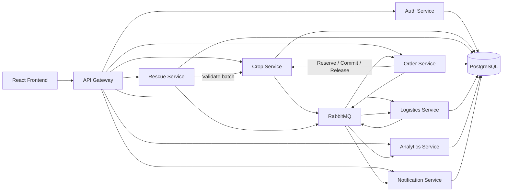

# AgriConnect

AgriConnect is a full-stack agricultural rescue and commerce platform. It connects farmers, buyers, logistics users, and administrators so crop batches can be listed, rescued, ordered, and tracked from supply to shipment.

## Features

- Role-based authentication with JWT for `ADMIN`, `FARMER`, `BUYER`, and `LOGISTICS` users.
- Crop and crop batch management for agricultural products.
- Rescue point and rescue registration workflows.
- Buyer cart, checkout, order, and shipment flows.
- Admin dashboards for users, rescue requests, subsidies, analytics, and coordination.
- Swagger/OpenAPI documentation for backend APIs.

## Tech Stack

### Backend

- Java 17
- Spring Boot
- Spring Security + JWT
- Spring Data JPA
- PostgreSQL
- Flyway migrations
- Maven

### Frontend

- React
- TypeScript
- Vite
- TanStack Router
- TanStack Query
- Axios
- Tailwind CSS / shadcn-style UI components

## Project Structure

```text
ArgiConnect/
  backend/     Spring Boot API, database migrations, tests
  frontend/    React client application
  run.bat      Windows helper script to start backend and frontend
```

## Prerequisites

Install these before running the project:

- Java 17+
- Node.js 20+
- npm
- Docker Desktop, for PostgreSQL

## Getting Started

### Run the full stack with Docker Compose

From the project root, start PostgreSQL, the backend, and the frontend:

First create a local secret file that is excluded from Git:

```powershell
Copy-Item .env.example .env
```

Edit `.env` and replace `POSTGRES_PASSWORD` and `JWT_SECRET`. Generate a JWT
secret with `openssl rand -hex 32`, or another cryptographically secure random
generator. Never commit `.env`.

```bash
docker compose up --build
```

Then open:

- Frontend: `http://localhost:5173`
- Backend: `http://localhost:8080`
- Swagger UI: `http://localhost:8080/swagger-ui.html`
- PostgreSQL: `localhost:5433`

Stop the stack with `docker compose down`. To also delete the database volume,
run `docker compose down -v`.

`VITE_API_URL` is embedded into the frontend at image build time and defaults to
`http://localhost:8080/api`. To use another browser-accessible backend URL:

```bash
VITE_API_URL=https://example.com/api docker compose build frontend
docker compose up
```

On PowerShell, set it with `$env:VITE_API_URL` before running the commands.

### 1. Start PostgreSQL

From the backend folder:

```bash
cd backend
docker compose up -d
```

The database runs on:

```text
localhost:5433
database: agriconnect
username: postgres
password: postgres
```

### 2. Start the backend

```bash
cd backend
./mvnw spring-boot:run
```

On Windows PowerShell:

```powershell
cd backend
.\mvnw.cmd spring-boot:run
```

Backend URL:

```text
http://localhost:8080
```

Swagger UI:

```text
http://localhost:8080/swagger-ui.html
```

### 3. Start the frontend

Create `frontend/.env` if it does not exist:

```env
VITE_API_URL=http://localhost:8080/api
```

Then run:

```bash
cd frontend
npm install
npm run dev
```

Frontend URL:

```text
http://localhost:5173
```

### Quick Start on Windows

You can also start both apps with:

```bat
run.bat
```

Start PostgreSQL first with Docker before using this script.

## Demo Accounts

The default password for seeded users is:

```text
123456
```

| Role | Email |
| --- | --- |
| Admin | admin.khang@sannongnghiep.vn |
| Farmer | tam.nongdan@gmail.com |
| Buyer | datngo.buyer@gmail.com |
| Logistics | tungdinh.logistics@gmail.com |

## Useful Commands

### Backend

```bash
cd backend
./mvnw test
./mvnw spring-boot:run
```

### Frontend

```bash
cd frontend
npm run dev
npm run build
npm run lint
```

## Insert Synthetic Data

The synthetic data generator creates a repeatable PostgreSQL seed containing
users, crops, crop batches, orders, shipments, crop locks, rescue points, and
rescue registrations. It also creates daily agricultural statistics for the AI
workflow.

> **Warning:** the generated SQL truncates and replaces existing application
> data by default. The database schema and Flyway migration history are kept.

Start the Docker stack and generate the files from the project root:

```powershell
docker compose up -d --build
python ai\generate_synthetic_seed.py
```

Copy the generated SQL into PostgreSQL and execute it:

```powershell
docker compose cp ai/output/agriconnect_synthetic_seed.sql postgres:/tmp/agriconnect_synthetic_seed.sql
docker compose exec postgres psql -U postgres -d agriconnect -f /tmp/agriconnect_synthetic_seed.sql
```

Verify the inserted users by role:

```powershell
docker compose exec postgres psql -U postgres -d agriconnect -c "SELECT role, COUNT(*) FROM users GROUP BY role ORDER BY role;"
```

Generated accounts use addresses such as:

```text
admin.0001@synthetic.agriconnect.vn
farmer.0001@synthetic.agriconnect.vn
buyer.0001@synthetic.agriconnect.vn
logistics.0001@synthetic.agriconnect.vn
```

The shared password for synthetic accounts is `123456`.

## Local AI Forecast MVP

AgriConnect includes a lightweight local machine learning workflow in `ai/` for forecasting agricultural supply quantity by province, crop, year, and month. It uses scikit-learn locally and does not call external AI APIs.

### Complete Docker AI workflow

Run the synthetic seed steps above first. They create
`ai/output/daily_province_crop_stats.csv`, which is the input for ETL.

Build the AI image, then run ETL and training in one-off containers:

```powershell
docker compose build ai
docker compose run --rm ai python etl.py
docker compose run --rm ai python train.py
```

The `ai/data`, `ai/models`, and `ai/output` directories are mounted into the
container, so datasets and trained models remain on the host.

Start the complete stack:

```powershell
docker compose up -d --build
```

The backend waits for the AI health check and connects to it through the Compose
network at `http://ai:8001`. No separate Uvicorn terminal is required. Verify
the service with:

```powershell
docker compose ps
curl.exe http://localhost:8001/health
```

Compose mounts `ai/data` read-only at `/ai/data` inside the backend so it can
import the cleaned CSV. If Compose configuration or a volume changes, recreate
the affected containers without deleting the PostgreSQL volume:

```powershell
docker compose up -d --force-recreate ai backend
```

Authenticate with a synthetic admin account:

```powershell
$loginBody = @{
  email = "admin.0001@synthetic.agriconnect.vn"
  password = "123456"
} | ConvertTo-Json

$login = Invoke-RestMethod `
  -Method Post `
  -Uri "http://localhost:8080/api/auth/login" `
  -ContentType "application/json" `
  -Body $loginBody

$headers = @{ Authorization = "Bearer $($login.accessToken)" }
```

Import the cleaned training dataset into PostgreSQL:

```powershell
Invoke-RestMethod `
  -Method Post `
  -Uri "http://localhost:8080/api/forecast-dataset/import-csv" `
  -Headers $headers
```

Generate forecasts through the local AI service and save them in PostgreSQL:

```powershell
Invoke-RestMethod `
  -Method Post `
  -Uri "http://localhost:8080/api/forecasts/generate-ai" `
  -Headers $headers
```

Verify the saved forecasts:

```powershell
Invoke-RestMethod `
  -Method Get `
  -Uri "http://localhost:8080/api/forecasts" `
  -Headers $headers
```

You can also perform the import and generation from the Admin Dashboard using
`Import Dataset` followed by `Generate AI Forecast`.

### 1. Create Python environment

The Docker workflow above is recommended. Use a local environment only for AI
development:

```powershell
cd ai
python -m venv .venv
.\.venv\Scripts\Activate.ps1
pip install -r requirements.txt
```

### 2. Prepare data

```powershell
python etl.py
```

This uses `ai/output/daily_province_crop_stats.csv` when available, aggregates daily rows into monthly province/crop training rows, and writes:

```text
data/cleaned_agri_forecast_dataset.csv
```

### 3. Train model

```powershell
python train.py
```

Outputs:

```text
models/agri_forecast_model.pkl
models/metrics.json
```

### 4. Generate forecast

```powershell
python predict.py
```

Or provide one prediction manually:

```powershell
python predict.py --province "An Giang" --crop-name "Nho" --year 2026 --month 6 --sold-quantity 18000 --average-price 25000
```

Batch prediction is also supported:

```powershell
python predict.py --input-csv data/cleaned_agri_forecast_dataset.csv
```

Forecast output is saved to:

```text
ai/data/forecast_result.csv
```

### 5. Import forecast into backend

Start PostgreSQL and the Spring Boot backend. First import the cleaned AI training dataset into PostgreSQL:

```text
POST /api/forecast-dataset/import-csv
```

Then train from the backend-owned dataset if desired:

```powershell
cd ai
python train.py --dataset-url "http://localhost:8080/api/forecast-dataset" --token "<ADMIN_JWT>"
```

To import the latest prediction output, call:

```text
POST /api/forecasts/import-csv
```

The backend keeps training data in `forecast_dataset_records` and prediction output in `forecast_results`.

The Admin Dashboard displays imported forecast rows and supports simple filters for province, crop, year, and month.

## Main API Areas

| Area | Base Path |
| --- | --- |
| Authentication | `/api/auth` |
| Users | `/api/users` |
| Crops | `/api/crops` |
| Crop batches | `/api/crop-batches` |
| Crop locks | `/api/crop-locks` |
| Orders | `/api/orders` |
| Order items | `/api/order-items` |
| Shipments | `/api/shipments` |
| Rescue points | `/api/rescue-points` |
| Rescue registrations | `/api/rescue-registrations` |
| Analytics | `/api/analytics` |
| Forecasts | `/api/forecasts` |

Use Swagger UI for request and response details.

## Notes for Development

- Backend database schema is managed by Flyway migrations in `backend/src/main/resources/db/migration`.
- Development seed data is loaded from `backend/src/main/resources/db/specific/dev`.
- Frontend API calls use `VITE_API_URL` from environment variables.
- JWT tokens are stored in browser local storage during development.

## Future Improvements

- Move local database credentials and JWT secrets to environment variables.
- Add GitHub Actions CI for backend tests, frontend lint, and frontend build.
- Add screenshots or a short demo flow to make the project easier to review.

## Deploy to Railway

Railway deploys this repository as four services in one project:

```text
Frontend (public) -> Backend (public) -> AI (private)
                                      -> PostgreSQL (managed)
```

Railway does not run the Compose file as one container. Each application uses a
Railway-specific Dockerfile under `.railway/`, while `docker-compose.yml`
continues to support local development.

### 1. Push the repository

Push the repository to GitHub. Do not commit `.env`; production secrets are set
in Railway's Variables tab.

### 2. Create the project and database

Create an empty Railway project, then add a managed PostgreSQL database. Keep
the default service name `Postgres`, or update the reference-variable names
below to match your chosen name.

### 3. Add the AI service

Create an empty service named `AI`, connect the GitHub repository, and use:

```text
Root Directory: /
Config File Path: /.railway/ai.json
```

Set this service variable:

```env
PORT=8001
RAILWAY_DOCKERFILE_PATH=.railway/ai.Dockerfile
```

The AI service only needs Railway private networking; a public domain is
optional.

### 4. Add the backend service

Create a service named `Backend`, connect the same repository, and use:

```text
Root Directory: /
Config File Path: /.railway/backend.json
```

Add these variables in the Backend service. Use Railway reference variables
exactly as shown rather than copying database credentials:

```env
RAILWAY_DOCKERFILE_PATH=.railway/backend.Dockerfile
DB_URL=jdbc:postgresql://${{Postgres.PGHOST}}:${{Postgres.PGPORT}}/${{Postgres.PGDATABASE}}
DB_USERNAME=${{Postgres.PGUSER}}
DB_PASSWORD=${{Postgres.PGPASSWORD}}
AI_FORECAST_SERVICE_URL=http://${{AI.RAILWAY_PRIVATE_DOMAIN}}:${{AI.PORT}}
JWT_SECRET=<generate-a-new-random-secret-of-at-least-32-bytes>
JWT_EXPIRATION=3600000
CORS_ALLOWED_ORIGINS=https://${{Frontend.RAILWAY_PUBLIC_DOMAIN}}
```

Generate a public Railway domain for Backend. Flyway runs automatically when
the backend connects to PostgreSQL. The Railway backend image also contains
`ai/data`, allowing the Admin Dashboard's dataset import action to work.

### 5. Add the frontend service

Create a service named `Frontend`, connect the repository, and use:

```text
Root Directory: /
Config File Path: /.railway/frontend.json
```

Generate a public domain and set:

```env
RAILWAY_DOCKERFILE_PATH=.railway/frontend.Dockerfile
VITE_API_URL=https://${{Backend.RAILWAY_PUBLIC_DOMAIN}}/api
```

`VITE_API_URL` is embedded during the frontend image build. Redeploy Frontend
after changing the Backend domain or this variable.

### 6. Deploy and verify

Deploy in this order for the first release:

1. PostgreSQL
2. AI
3. Backend
4. Frontend

Verify the public endpoints:

```text
https://<backend-domain>/v3/api-docs
https://<frontend-domain>/
```

Check the AI `/health` endpoint from Railway deployment logs or temporarily
generate an AI public domain. Backend-to-AI traffic stays on Railway's private
network over HTTP.

### Railway reports `Railpack could not determine how to build the app`

This means Railway did not load the service's `.railway/*.json` file and fell
back to Railpack. It is not an application error, and this repository does not
use a `start.sh` script.

For each service, open **Settings → Build** and verify:

1. Root Directory is `/`.
2. Config File Path is the service-specific JSON path listed above.
3. Builder is `Dockerfile`, not `Railpack`.
4. Dockerfile Path matches the service:
   - AI: `.railway/ai.Dockerfile`
   - Backend: `.railway/backend.Dockerfile`
   - Frontend: `.railway/frontend.Dockerfile`
5. Remove any custom Build Command or Start Command, especially `start.sh`.

The `RAILWAY_DOCKERFILE_PATH` variables above provide an additional explicit
override if Config File Path is not applied during the first deployment. After
saving the settings, choose **Redeploy** or **Deploy Latest Commit**. A correct
build log starts with `Using detected Dockerfile` instead of Railpack analysis.


# Incremental microservice migration

AgriConnect uses a practical Strangler-pattern architecture. Public business traffic is routed to the extracted services; core-service remains only for order-item and forecast compatibility until those legacy contracts are migrated and production reconciliation is complete. This is an incremental migration, not a fully distributed architecture.



## Service responsibilities

| Service | Port | Responsibility | PostgreSQL schema |
|---|---:|---|---|
| frontend | 5173 | Existing React UI; calls only the gateway | none |
| api-gateway | 8080 | Routes, CORS, request logs, health, timeouts and 503 fallback | none |
| auth-service | 8081 internal | Registration, login, users, BCrypt, JWT issuance | `auth_schema` |
| core-service (`backend/`) | 8082 internal | Temporary order-item and forecast compatibility adapters | `core_schema` |
| analytics-service | 8083 internal | Event-based dashboards/read models and forecast compatibility | `analytics_schema` |
| crop-service | 8084 internal | Crops, crop batches and inventory reservations | `crop_schema` |
| rescue-service | 8085 internal | Rescue registration and point workflows | `rescue_schema` |
| order-service | 8086 internal | Crop-lock compatibility, orders, idempotency and compensation | `order_schema` |
| logistics-service | 8087 internal | Shipments and shipment status | `logistics_schema` |
| notification-service | 8088 internal | Stored user notifications | `notification_schema` |
| rabbitmq | internal; 15672 local | Domain-event transport, retries and DLQs | none |
| ai | 8001 internal | Existing Python model runtime used by forecasting | files/models |

JWTs are signed with the same `JWT_SECRET`. Their subject is the numeric user ID and they also contain `userId`, `email`, `role`, and `roles`. Core and analytics validate tokens locally; neither calls auth-service during authentication.

## Gateway routing

| Public prefix | Destination |
|---|---|
| `/api/auth/**`, `/api/users/**` | auth-service |
| `/api/crops/**`, `/api/crop-batches/**`, `/api/batches/**` | crop-service (`batches` is rewritten for compatibility) |
| `/api/rescue-registrations/**`, `/api/rescue-points/**` | rescue-service |
| `/api/crop-locks/**`, `/api/orders/**` | order-service |
| `/api/shipments/**` | logistics-service |
| `/api/notifications/**` | notification-service |
| `/api/order-items/**` | core-service compatibility adapter |
| `/api/dashboard/**`, `/api/analytics/**`, `/api/ai/**` | analytics-service |
| `/api/inventory-risk-forecast/**`, `/api/forecasts/**`, `/api/forecast-dataset/**` | analytics-service |

Canonical analytics reads are `GET /api/dashboard`, `/api/analytics/inventory-risk`, `/api/analytics/rescue-priority`, `/api/analytics/production-forecast`, and `/api/analytics/demand-forecast`. Existing frontend analytics paths remain compatible.

## Local startup

Copy `.env.example` to `.env`, replace secrets, then run:

```powershell
docker compose --profile demo up -d --build
docker compose --profile full up -d --build
```

Open `http://localhost:5173`. Only ports 5173 and 8080 are published; service and database ports remain on the Compose network. Check `http://localhost:8080/actuator/health` for gateway health.

Required variables are `POSTGRES_PASSWORD`, `RABBITMQ_PASSWORD`, a Base64 `JWT_SECRET` of at least 256 bits, and `INTERNAL_API_KEY`. Optional variables include `POSTGRES_DB`, `POSTGRES_USER`, `RABBITMQ_USER`, `JWT_EXPIRATION`, `CORS_ALLOWED_ORIGINS`, `VITE_API_URL` (gateway origin only, default `http://localhost:8080`), and `JAVA_TOOL_OPTIONS`. Never commit production values.

Internal APIs are not routed by the Gateway. Order-service calls crop inventory reservation endpoints, rescue-service validates batches through crop-service, and analytics backfill reads paginated DTO exports. All require `X-Internal-Api-Key`.

Domain events use the `agriconnect.events` topic exchange and a versioned envelope with `eventId`, `eventType`, `eventVersion`, aggregate identity, timestamp, trace ID, producer and minimal payload. Operational services save business state and outbox event in one transaction. Consumers record processed event IDs before acknowledgement. Important queues have bounded retries and DLQs.

Checkout reserves inventory first. If order persistence fails, order-service releases the reservation and records compensation state. Successful checkout commits inventory and publishes order events; logistics creates one shipment idempotently from `OrderConfirmed`. Reusing an `Idempotency-Key` with an identical request returns the original result, while a different request returns `409`.

## Verification

```bash
cd backend && mvn test
cd ../auth-service && mvn test
cd ../analytics-service && mvn test
cd ../api-gateway && mvn test
cd ../crop-service && mvn test
cd ../rescue-service && mvn test
cd ../order-service && mvn test
cd ../logistics-service && mvn test
cd ../notification-service && mvn test
cd ../frontend && npm run build
cd .. && docker compose --env-file .env --profile full config --quiet
docker compose --profile full up -d --build
jmeter -n -t tests/jmeter/agriconnect-microservices.jmx -JGATEWAY_HOST=localhost -JGATEWAY_PORT=8080 -JTOKEN=<buyer-token> -JBATCH_ID=<id> -JLOCK_ID=<id>
```

Stopping analytics-service or notification-service must not interrupt authentication or orders. Detailed JMeter prerequisites and outage verification are in `tests/jmeter/README.md`.

## Database migration and known limitations

Each service uses Flyway and its own default schema. Repositories do not query another service schema. Fresh installations seed auth and core compatibility users with the same IDs so existing numeric ownership references remain stable.

For an existing PostgreSQL volume, back up the database before rollout and perform a one-time ID-preserving copy from the legacy `public.users` table into `auth_schema.users`, then reset the auth sequence. This is intentionally not automatic because overwriting a live identity table is unsafe. During this Strangler phase, core retains a compatibility shadow `users` table for a small number of display/enrichment queries; authorization and ownership use JWT claims. New auth registrations are therefore not automatically copied into that shadow, and enrichment may omit a newly registered user's display data. Transactional order, crop-lock and inventory logic is unchanged.

Analytics dashboard, inventory-risk, and rescue-priority endpoints use local event read models. Production/demand forecast and legacy AI endpoints still use the temporary core compatibility adapter. Core also temporarily serves `/api/order-items/**`. Remove core-service only after migrating these contracts, running the full E2E/JMeter suite against containers, reconciling row counts/external IDs, and completing the documented rollback window.

Migration scripts copy IDs without deleting legacy tables: `docker/migrate-phase2-3.sql` and `docker/migrate-phase4-5.sql`. Take a backup, run the scripts, verify their row-count output, then cut over writes. Rollback instructions are in `docs/DATABASE_ROLLBACK.md`; never route writes back to stale legacy tables without reconciliation.

No Eureka, Kubernetes, Kafka, service mesh, event sourcing, full CQRS, distributed database transaction, or additional PostgreSQL container is used.

## Nạp synthetic data tự động bằng Docker

File `ai/output/agriconnect_synthetic_seed.sql` chứa `TRUNCATE`, vì vậy mỗi lần chạy sẽ **xóa và thay thế toàn bộ** users, crops, batches, rescue data, orders, locks và shipments hiện có. Không dùng lệnh này trên production.

Sau khi các service đã build, chạy one-shot seed service từ thư mục gốc:

```bash
docker compose --profile seed run --rm seed-data
```

Seed service tự chọn `core_schema`, chạy SQL với `ON_ERROR_STOP`, đồng bộ users sang `auth_schema`, rồi chạy hai migration copy để nạp `crop_schema`, `rescue_schema`, `order_schema` và `logistics_schema`. Các service phải được khởi động ít nhất một lần để Flyway tạo schema trước khi chạy seed. Sau khi seed hoàn tất, khởi động hoặc làm mới stack:

```bash
docker compose up -d
```

Mật khẩu của synthetic users dùng hash demo được ghi trong file sinh dữ liệu. Kiểm tra comment đầu file hoặc script generator để biết mật khẩu rõ tương ứng.
