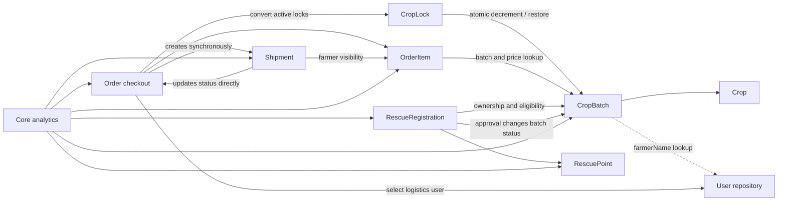

# AgriConnect service extraction plan

This document records the verified monolith dependencies before extraction. The migration uses the Strangler Pattern: old `core-service` tables and controllers remain available as rollback sources until each new service is built, tested, routed, and its row counts are verified.

## Verified dependency map



| Current module | Direct dependencies outside its intended ownership | Coupling to remove |
|---|---|---|
| crop batches | `UserRepository` | Replace name enrichment with a snapshot/batched auth lookup; identity remains the JWT user ID. |
| crop locks | `CropBatchRepository` | Crop service owns atomic reserve, commit, release, and expiry. Order service stores the external reservation ID. |
| rescue registrations | crop batch repository and a Criteria `User` root | Validate through crop-service internal REST and store farmer/admin IDs plus display snapshots. |
| orders/order items | crop batch, crop lock, shipment, and user repositories | Reserve/commit/release through crop-service; shipment creation becomes an event after REST extraction is stable. |
| shipments | order, order item, and crop batch repositories | Store visibility snapshots/external IDs; publish shipment events consumed idempotently by order-service. |
| analytics | operational repositories | Replace with analytics-owned read models fed by events and a restartable backfill. |

## Current transaction and inventory behavior

1. Creating an active crop lock performs one conditional SQL update that subtracts `crop_batches.current_quantity`. If no row changes, the request fails.
2. Lock expiry is request-triggered only. `CropLockService` restores quantity when selected APIs happen to invoke its private expiry method; there is no scheduled cleanup.
3. Checkout converts the buyer's active locks, creates the order and order items, selects the first active logistics user, and creates a pending shipment in one core database transaction.
4. Order items do not decrement inventory. The earlier lock already did so.
5. Cancelling an order restores item quantities with a read-modify-save operation. This can race and currently treats cancellation as returning stock even after lock conversion.
6. Rescue approval changes the crop batch to `available` in the rescue transaction.
7. Shipment status changes directly update order status. This crosses the future logistics/order boundary.

## Existing public compatibility contracts

The gateway must keep the following paths and query strings unchanged during cutover:

| Paths | Current methods/important variants | Target owner |
|---|---|---|
| `/api/crops/**` | GET, POST, PUT, DELETE | crop-service |
| `/api/crop-batches/**`, `/api/batches/**` | list filters, `page`, `size`, `/my`, GET, POST, PUT, DELETE | crop-service |
| `/api/rescue-registrations/**` | filters, `/my`, approve/reject compatibility paths | rescue-service |
| `/api/rescue-points/**` | GET, POST, PUT, DELETE | rescue-service |
| `/api/crop-locks/**` | GET, POST, PUT, DELETE | order-service facade backed by crop inventory reservations |
| `/api/orders/**`, `/api/order-items/**` | list filters, `/my`, `/checkout`, status patch, CRUD | order-service |
| `/api/shipments/**` | filters, `/my`, `/order/{orderId}`, status patch | logistics-service |

PUT compatibility remains until the frontend is migrated; PATCH may be added without removing PUT. Caller-supplied buyer/farmer/admin IDs are ignored where identity is available from JWT.

The repository contains historical JMeter CSV output but no `.jmx` plans. New plans must cover the preserved gateway paths plus concurrent reservation, duplicate idempotency keys, and logistics outage recovery.

## Target ownership and schema cutover

| Service | Schema | Tables moved/copied first |
|---|---|---|
| auth-service | `auth_schema` | users and auth tokens (already extracted) |
| crop-service | `crop_schema` | crops, crop_batches, inventory_reservations, inventory_movements, outbox_events, processed_events |
| rescue-service | `rescue_schema` | rescue_points, rescue_registrations, status history, outbox/processed events |
| order-service | `order_schema` | crop-lock compatibility records, orders, order_items, status history, idempotency, saga, outbox/processed events |
| logistics-service | `logistics_schema` | shipments, status history, assignments, outbox/processed events |
| analytics-service | `analytics_schema` | snapshots/facts, forecasts and risk scores |

No new service may query `core_schema` or another service schema. Existing IDs are copied explicitly. Cross-schema foreign keys are not created. Old tables are not deleted or mutated by migration scripts.

## Inventory decision

Crop service uses:

```text
initial_quantity = available_quantity + reserved_quantity + sold_quantity
```

The compatibility mapping is `current_quantity -> available_quantity`, with existing converted locks represented initially as committed/sold allocations. New checkout preserves visible availability by reserving at crop-lock creation. Inventory becomes sold when checkout successfully creates the order, matching the current fact that converted locks are no longer releasable as locks. A pre-shipping cancellation uses an explicit compensated return movement for backward compatibility; later cancellation requires an explicit review state rather than a silent increment.

All quantity transitions use conditional SQL updates in the crop schema. Expiry is scheduled, claims rows atomically, and is idempotent.

## Incremental cutover checklist

1. Create crop-service and copy data into `crop_schema`; keep core crop writes active until API/concurrency tests pass.
2. Route crop reads/writes and inventory internal APIs to crop-service; retain core adapters for rollback.
3. Extract rescue-service and replace its repository joins with crop internal REST.
4. Extract order-service only after reservation concurrency tests pass; add idempotency and compensation before routing writes.
5. Extract logistics-service over REST first, then switch shipment creation to `OrderConfirmed` events.
6. Add RabbitMQ, transactional outboxes, bounded retries, processed-event tables, and DLQs.
7. Backfill analytics read models, compare results, then remove per-request operational fan-out.
8. Switch gateway routes, run E2E/JMeter tests, verify row counts and external IDs, and keep core tables read-only for a rollback window.

Rollback for each cutover is a gateway route reversal. Data reconciliation must run before reversing writes; automatic deletion or reverse copying is intentionally excluded.

## Phase 6-8 event and internal-security implementation

- Topic exchange: `agriconnect.events` (override with `EVENTS_EXCHANGE`).
- Logistics consumes `order.confirmed` through `logistics.order-events`; failures after three attempts are dead-lettered to `logistics.order-events.dlq`.
- Order consumes `shipment.#` through `order.shipment-events`; failures after three attempts are dead-lettered to `order.shipment-events.dlq`.
- Every operational schema writes versioned envelopes into its own `outbox_events` table in the same PostgreSQL transaction through schema-owned triggers.
- Scheduled publishers use `FOR UPDATE SKIP LOCKED`, bounded attempts, publisher confirms, and retain permanently failed rows as `FAILED` for inspection.
- Consumers save `eventId` in their own `processed_events` table in the same transaction as their state change.
- All `/internal/**` requests require `X-Internal-Api-Key`. User-facing endpoints continue to validate JWT locally.
- `X-Trace-Id` is accepted/generated at each service boundary and forwarded by Rescue→Crop and Order→Crop REST clients.

RabbitMQ/PostgreSQL integration is not yet certified because Docker Compose deployment is intentionally handled after Gateway routing. Unit tests verify consumer deduplication; the Compose phase must verify Flyway V2 triggers, broker confirms, retries, and DLQ delivery against real containers.

## Analytics event read models

Analytics now consumes `crop.#`, `inventory.#`, `rescue.#`, `order.#`, and `shipment.#` into `analytics_schema` tables: `crop_batch_snapshots`, `inventory_snapshots`, `rescue_facts`, `order_facts`, and `shipment_facts`. `GET /api/dashboard`, `/api/analytics/inventory-risk`, and `/api/analytics/rescue-priority` read only these local models.

The restartable admin command `POST /api/analytics/backfill` reads paginated DTO exports from each operational service, records `backfill_checkpoints`, and uses deterministic event IDs so an interrupted page can be replayed safely. Pass `reset=true` to deliberately rescan all sources.

Production/demand forecast and legacy AI endpoints remain temporary core compatibility adapters. They must move after forecast tables/model execution are migrated; the new dashboard endpoints no longer fan out to core.

## Compose profiles

```powershell
docker compose --profile demo up -d --build
docker compose --profile full up -d --build
```

`demo` runs Gateway, frontend, auth, crop, order, analytics, core forecast compatibility, AI, PostgreSQL and RabbitMQ. Rescue, logistics and notifications are intentionally unavailable. `full` additionally starts rescue-service, logistics-service and notification-service. Only ports 5173, 8080 and the local RabbitMQ management UI on 15672 are exposed.

Core-service remains in both profiles only because production/demand forecasting still uses the compatibility adapter. It must be removed after forecast execution and historical forecast tables move to analytics-service.

### Phase 2-3 data copy

After both new services have run their Flyway migrations and after taking a backup:

```powershell
Get-Content docker/migrate-phase2-3.sql | docker compose exec -T postgres psql -U postgres -d agriconnect
```

Review the four row-count results before changing any Gateway route. The script preserves source tables and IDs and is restartable through `ON CONFLICT DO NOTHING`.

## Phase 14: Resilience

- Gateway routes use a Resilience4j circuit breaker and a bounded response timeout.
- Only idempotent `GET` requests are retried: two attempts for `502`, `503`, or `504`, with exponential backoff from 100 ms to 500 ms. Mutating requests are never retried automatically.
- Rescue-to-crop and order-to-crop synchronous calls use a 2-second connection timeout and a 5-second read timeout.
- Downstream failures remain isolated: analytics or notification outages do not prevent authentication, crop, or order traffic from being routed.
- Order and inventory write idempotency continues to be enforced by database keys and processed-event records; the retry policy does not replace those guarantees.

## Phase 15: Observability

- Gateway and every extracted service accept or generate `X-Trace-Id`, return it to callers, forward it on internal REST calls, and place it in MDC for log correlation.
- Request logs are emitted as single-line JSON-shaped records with service, trace ID, authenticated user ID where available, normalized endpoint, status, and duration.
- Micrometer counters/timers cover Gateway traffic and per-service HTTP traffic. Actuator exposes `health`, `info`, and `metrics`.
- Schema-local gauges report pending outbox events, reservation/order/shipment totals, failed compensations, analytics backfill/event state, and unread/processed notifications.
- RabbitMQ queue depth and DLQ depth are operational broker metrics and should be monitored through the RabbitMQ management endpoint; application services do not query broker internals.

This phase intentionally does not add Prometheus, Grafana, or a distributed tracing backend. Actuator metrics and trace-correlated logs provide a low-memory foundation; production deployment can add an external scraper and log collector without changing business services.
